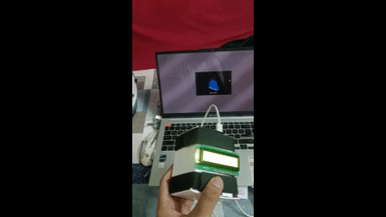

# MotionCube (3D Motion Tracker)

A real-time 3D motion tracker that visualizes orientation data (roll and pitch) from a microcontroller (like Arduino) using Processing. Perfect for learning about sensors, serial communication, and 3D graphics!

## Features
- Real-time 3D visualization of orientation
- Smooth animation using roll and pitch data
- Simple, clean Processing code
- Easy to adapt for different sensors or microcontrollers

## How It Works
- The microcontroller (e.g., Arduino) reads orientation data from sensors (like MPU6050, gyroscope, or accelerometer).
- It sends roll and pitch values over serial (USB) to your computer.
- The Processing sketch receives this data and rotates a 3D box to match the orientation.

## Setup Instructions
1. **Hardware:**
   - Connect your sensor (e.g., MPU6050) to your microcontroller (e.g., Arduino Uno).
   - Upload the Arduino code (see `Final_PBL_Code.ino`) to your board.
2. **Software:**
   - Install [Processing](https://processing.org/download/).
   - Install the Processing Serial library (usually included by default).
   - Update the COM port in `processing_PBL_code.pde` if needed (default is `COM4`).
   - Run the Processing sketch.
3. **See it in action!**
   - Move your sensor and watch the 3D box rotate in real time.

## Usage
- The Processing window will display a 3D box.
- Roll and pitch values are shown on screen.
- Move your sensor to see the box rotate accordingly.

## Project Name Ideas
- MotionCube
- Track3D
- GyroBox
- OrientaBox
- PoseViz
- AxisTracker

## Team Credits
- [Your Names Here]

## Suggestions for Improvements
- Add data logging (save roll/pitch to a file)
- Real-time graph of roll/pitch
- Web-based visualization
- Customizable COM port selection
- Error handling for serial connection
- Add a schematic or block diagram of your hardware setup

## License
MIT (or your preferred license) 

## Demo

A demonstration video of the MotionCube in action is included in this repository.

[Download Demo Video](demo.mp4)

To view the demo, download the file and open it with your preferred media player. 